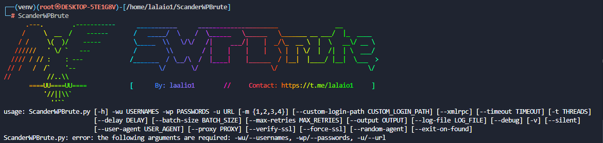

# 🛡️ **ScanderWPBrute - WordPress Brute Force Tool** 🔓


ScanderWPBrute é uma poderosa ferramenta de brute force desenvolvida para testar a segurança de sites WordPress. Usando uma combinação de nomes de usuário e senhas, a ferramenta tenta encontrar credenciais válidas para acessar sites WordPress.

---

## 🚀 **Recursos Principais**

- **Ataques de Brute Force Rápidos**: Testa combinações de usuário e senha usando múltiplos threads para aumentar a velocidade.
- **Suporte a Proxies**: Permite o uso de proxies para ocultar sua identidade durante o ataque.
- **Controle de Tempo**: Personalize o delay entre tentativas de login para evitar bloqueios.
- **Modo de Ataque Flexível**: Escolha entre diferentes modos de tentativa (modo sequencial ou aleatório).
- **Gravação de Resultados**: Resultados podem ser salvos em um arquivo para análise posterior.
- **Ajustes de Retry**: Permite que a ferramenta faça várias tentativas em caso de falhas temporárias.
- **Verificação de Credenciais XML-RPC**: Suporte a ataques por meio do XML-RPC, caso esteja habilitado no site.
- **Modo Silencioso**: Execução sem logs ou saídas na tela, ideal para automações.

---

## 🔧 **Instalação**

### Pré-requisitos

Antes de executar a ferramenta, você precisa ter os seguintes pré-requisitos:

- Python 3.6+ 🐍
- Pip 🛠️

### Passos 💨 

1. Inicie o instalador:
    ```bash
    sudo apt-get install -y curl && curl -s https://raw.githubusercontent.com/lalaio1/ScanderWPBrute/main/install.sh -o install.sh && sudo chmod +x install.sh && sudo ./install.sh

    ```
---
### Imagens 🖼

---

## ⚙️ **Uso**

### Executar a ferramenta

Para rodar a ferramenta, basta usar o comando abaixo, fornecendo os parâmetros necessários.

```bash
ScanderWPBrute --url https://example.com --usernames usernames.txt --passwords passwords.txt --threads 10 --mode 1 --output results.txt
```

---

## 📜 **Parâmetros**

| Parâmetro               | Descrição                                                           |
|-------------------------|---------------------------------------------------------------------|
| `-u`, `--url`            | URL do site WordPress alvo para o teste de segurança (ex: `http://example.com/wp-login.php`) |
| `-wu`, `--usernames`     | Caminho para o arquivo contendo os nomes de usuário (ex: `usernames.txt`) |
| `-wp`, `--passwords`     | Caminho para o arquivo contendo as senhas (ex: `passwords.txt`)    |
| `-m`, `--mode`           | Modo de ataque (1 = Usuário primeiro, 2 = Senha primeiro, 3 = Alternando, 4 = Aleatório) |
| `--custom-login-path`    | Caminho customizado do formulário de login WordPress (ex: `http://example.com/custom-login.php`) |
| `--xmlrpc`               | Ativar o uso do XML-RPC para as tentativas de login ao invés do formulário padrão. |
| `--timeout`              | Tempo limite de requisição em segundos (ex: `10.0`). Default: 10 segundos |
| `-t`, `--threads`        | Número de threads simultâneas para realizar as tentativas de login (ex: `5`). Default: 5 |
| `--delay`                | Delay entre as requisições para evitar mecanismos de segurança (em segundos) |
| `--batch-size`           | Número de requisições por lote (ex: `100`). Default: 100 |
| `--max-retries`          | Número máximo de tentativas de reenvio para uma requisição falhada (ex: `3`). Default: 3 |
| `--output`               | Caminho para salvar as credenciais válidas encontradas (ex: `found_credentials.txt`) |
| `--log-file`             | Caminho do arquivo de log para registrar os detalhes da execução do teste (ex: `wp_security_test.log`). Default: `wp_security_test.log` |
| `--debug`                | Ativa o modo de depuração para logs detalhados. |
| `-v`, `--verbose`        | Exibe informações detalhadas sobre cada tentativa de login. |
| `--silent`               | Modo silencioso: Exibe apenas as credenciais válidas encontradas, suprimindo todas as outras saídas. |
| `--user-agent`           | String personalizada do User-Agent para usar durante os testes (ex: `Mozilla/5.0...`) |
| `--proxy`                | URL do proxy (ex: `socks5://127.0.0.1:9050`) para direcionar as requisições através dele. |
| `--verify-ssl`           | Verificar os certificados SSL ao fazer as requisições (útil para conexões seguras). |
| `--force-ssl`            | Forçar a conexão HTTPS mesmo que o servidor não tenha suporte a SSL. |
| `--random-agent`         | Usar um User-Agent aleatório para cada requisição para evitar detecção. |
| `--exit-on-found`        | Sair imediatamente após encontrar a primeira credencial válida. |

---

## 📝 **Exemplo de Execução**

```bash
python scanderwpbrute.py \
  --url https://example.com \
  --usernames usernames.txt \
  --passwords passwords.txt \
  --threads 5 \
  --mode 4 \
  --delay 1 \
  --output result.txt
```

Este comando tentará fazer um brute force no site `https://example.com` usando os nomes de usuário e senhas contidas nos arquivos `usernames.txt` e `passwords.txt`, com 5 threads e um atraso de 1 segundo entre as tentativas.

---

## 💡 **Dicas**

- **Escolha listas de senhas fortes**: Listas como `rockyou.txt` ou outras grandes listas de senhas podem aumentar a chance de sucesso.
- **Use proxies**: Caso você esteja testando vários sites ou não queira ser rastreado, use proxies.
- **Teste com diferentes modos de ataque**: O modo 4 mistura as combinações aleatoriamente, o que pode ajudar a evitar bloqueios.
- **Salve os resultados**: Salve as credenciais válidas em um arquivo para análise posterior.

---

## 🔑 **Contribuindo**

Se você deseja contribuir para o projeto, siga os passos abaixo:

1. Fork este repositório.
2. Crie sua branch (`git checkout -b feature-xyz`).
3. Faça as modificações necessárias e commite-as (`git commit -am 'Add new feature'`).
4. Envie suas modificações (`git push origin feature-xyz`).
5. Abra um Pull Request.

---

## 📜 **Licença**

Este projeto está licenciado sob a Licença MIT - consulte o arquivo [LICENSE](LICENSE) para mais detalhes.

---

## 📞 **Contato**

Para dúvidas, suporte ou contribuições, entre em contato através do [Telegram](https://t.me/lalaio1).

---
